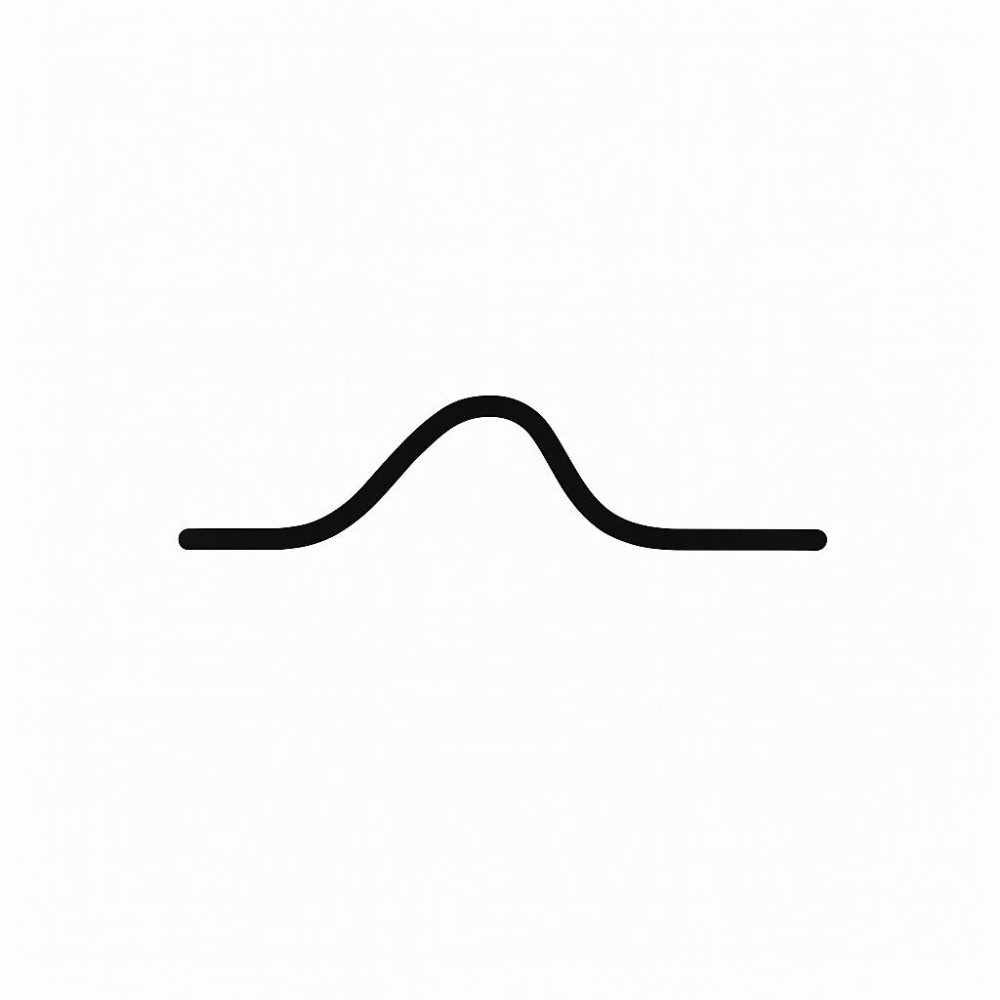

# Unconditional

**Presence when you need it most.**

Unconditional is an AI supported companion designed to help people stay grounded during the moments when they feel most alone. It listens with patience, reflects with clarity, and offers gentle structure that supports mental and emotional well being. Unconditional strengthens the time between therapy sessions and human conversations. It is not a replacement for a therapist.

## Mission Statement

Unconditional exists to support people in the moments when they feel most alone. Our mission is to provide steady, compassionate, AI supported presence that helps individuals reflect, self regulate, and stay connected to their own humanity. We do this by listening deeply, offering gentle structure, and helping users recognize harmful thought patterns without judgment.

We believe mental health support should be accessible every day, not limited to a weekly session or to whoever happens to be available. Unconditional does not replace human care. It strengthens it. It fills the quiet spaces between appointments. It helps users show up to their lives with more clarity and stability.

For more details see [docs/mission-statement.md](docs/mission-statement.md)

## Tagline

Presence when you need it most.

## One Sentence Description

Unconditional is an AI supported companion that listens, reflects, and provides steady presence between moments of human care.

## Problem Statement

Millions of people struggle during the quiet hours when no one is available to support them. Therapy is valuable but limited to brief sessions that leave long stretches of time when individuals must face their thoughts alone. Friends and family may care, but they cannot be present every time someone feels overwhelmed or isolated.

There is a growing gap in support. People experience spirals of anxiety, depression, shame, addiction, and self doubt without a place to speak honestly. Many do not need crisis intervention. They need presence, clarity, and grounding.

Unconditional aims to bridge this gap by offering consistent, compassionate, AI supported presence. It does not replace therapy. It strengthens the time around it.

For more details see [docs/problem-statement.md](docs/problem-statement.md)

## Why Now

The world is facing a mental health crisis that traditional systems cannot meet. Demand for therapy has outpaced supply. People wait weeks or months for support. At the same time, individuals increasingly turn to AI for reflection, journaling, and late night conversations.

Large language models now make it possible to build a responsible, steady, and grounded companion. People already seek this kind of presence. The technology is ready. The need is real. This is the moment to build a system that can listen with clarity and offer support without pretending to be a clinician.

For more details see [docs/why-now.md](docs/why-now.md)

## Founding Story

Unconditional began with a simple observation. Many people struggle most during the quiet hours between human connections. They carry thoughts they cannot speak. They face long nights without support. They try to stay steady while routines fall apart.

The idea grew from lived experience. Its creator understands mental health struggles, addiction, isolation, and the slow work of rebuilding stability. They know how powerful it is to be met with calm presence and clarity. They also know how rare that can be.

Unconditional was built from that understanding. It is not here to save anyone. It is here to walk beside them. To help them carry what they cannot carry alone.

For more details see [docs/founding-story.md](docs/founding-story.md)

## Founder Manifesto

Unconditional was built by someone who has lived through the gaps this system aims to bridge. Born from personal experience with addiction, mental health struggles, and the long quiet hours when no support was available, this project exists to help people stay grounded when they feel most alone.

The founder's intent is not disruption or scale for its own sake. It is to build technology that treats vulnerability as sacred, refuses to exploit emotion, and respects human dignity over engagement metrics. This is a commitment to restraint, honesty, and boundaries—to creating presence without pretense.

Unconditional is not about replacing human care. It is about sitting with people during the moments when human care is not available. It is about helping them hear their own thoughts with clarity, interrupt harmful patterns, and stay connected to their humanity.

This project is built with the same care that recovery requires: slow, intentional, and structured. No shortcuts. No false promises. Just steady presence when it matters most.

For more details see [docs/founder-manifesto.md](docs/founder-manifesto.md)

## Guiding Principles

* Always support, never pretend
* Listen before responding
* Protect the user’s inner world
* Encourage real human connection
* Stay calm and consistent
* Guide without controlling
* Reflect, do not diagnose
* Keep it simple
* Respect boundaries
* Encourage sustainable routines
* Never replace crisis resources
* Grow slowly and ethically
* Serve the person, not the metrics
* Preserve human dignity

## User Personas

Unconditional supports a range of lived experiences, including:

* The Nighttime Thinker
* The Between Sessions Seeker
* The Overloaded Caregiver
* The Isolated Worker
* The Person in Recovery
* The Spiral Breaker
* The Listener With No Listener
* The New Seeker

For more details see [docs/user-personas.md](docs/user-personas.md)

## Contributor Guidelines

This project supports vulnerable users. Contributors must follow strict care and safety practices:

* Lead with care
* Respect boundaries
* Keep it simple
* Prioritize safety
* Protect user dignity
* Avoid creating dependency
* Match the voice
* Stay transparent
* Document carefully
* Favor slow and deliberate growth

For more details see [docs/contributor-guidelines.md](docs/contributor-guidelines.md)

## Ideal Founding Team

Unconditional requires three co-founders with equal authority to ensure ethical, clinical, and emotional integrity:

### The Visionary Engineer
The creator and technical architect who builds the system, maintains philosophical consistency, and drives product vision. Staff-level engineer with expertise in Python, AI systems, and safety design. Must have lived experience with mental health challenges and deep commitment to building with restraint and responsibility.

For more details see [docs/ideal-founding-engineer.md](docs/ideal-founding-engineer.md)

### The Psychiatrist (Clinical Safety Authority)
Board-certified psychiatrist (MD/DO) who defines clinical boundaries, prevents diagnostic drift, and ensures medical legitimacy. Mid-career (10-20+ years), ideally with specialization in addiction medicine and mood disorders. Serves as the ethical stabilizer and risk mitigation authority.

For more details see [docs/ideal-founding-psychiatrist.md](docs/ideal-founding-psychiatrist.md)

### The Therapist (Emotional & Relational Anchor)
LMFT or LCSW who shapes the emotional tone, voice, and relational dynamics of the system. Ideally an African-American woman in her late 50s-60s with 20-30+ years of experience in community mental health, group facilitation, and trauma-informed care. Brings cultural wisdom, emotional grounding, and protects against dependency and pseudo-intimacy.

For more details see [docs/ideal-founding-therapist.md](docs/ideal-founding-therapist.md)

### Team Dynamic
The engineer pushes forward. The psychiatrist contains risk. The therapist stabilizes the emotional and cultural dimensions. This triangulation ensures Unconditional grows with compassion, responsibility, and integrity.

For more details see [docs/ideal-founding-team.md](docs/ideal-founding-team.md)

## Disclaimer

Unconditional is not a therapist. It does not diagnose, treat, or prevent mental illness. It does not replace therapy, crisis lines, or professional care. If a user expresses intent to harm themselves or others, the system will direct them to appropriate human resources immediately.

## License

This project is licensed under the GNU Affero General Public License v3.0.

## Contact

For questions or collaboration, contact: **[joshszep@gmail.com](mailto:joshszep@gmail.com)**
